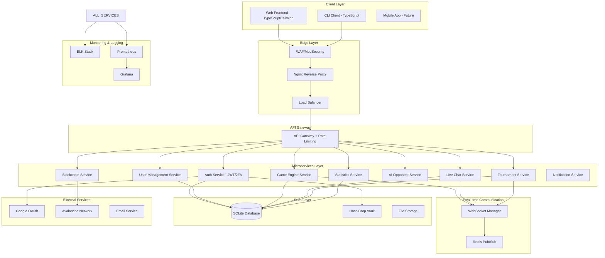

# ft_transcendence - Application Architecture Overview

## Executive Summary
This architecture diagram outlines the complete ft_transcendence application structure, incorporating all mandatory requirements and the 15+ modules needed for 100% completion. The design follows a microservices approach with server-side game logic.

---

## 🏗️ High-Level Architecture



---

## 🎯 Core Components Breakdown

### 1. Client Applications
- **Web Frontend**: TypeScript SPA with Tailwind CSS
- **CLI Client**: TypeScript-based terminal client for Pong vs web users
- **Mobile Support**: Responsive design for all devices

### 2. Security & Edge Layer
- **WAF/ModSecurity**: Web application firewall with hardened configuration
- **Nginx**: Reverse proxy with SSL termination and security headers
- **HashiCorp Vault**: Secrets management for sensitive data

### 3. Microservices Architecture

#### Authentication Service
- JWT token management with 2FA
- Google OAuth integration
- User session management
- Password security (bcrypt)

#### Game Engine Service (Server-Side Pong)
- Real-time game state management
- Physics engine for ball/paddle collision
- Multi-player game coordination (2+ players)
- Game history tracking
- Multiple game types support

#### User Management Service
- User profiles with avatars
- Friend system with online status
- Cross-tournament user persistence
- GDPR compliance features

#### Live Chat Service
- Real-time messaging system
- Direct messages and game invitations
- User blocking functionality
- Tournament notifications

#### Tournament Service
- Tournament creation and management
- Matchmaking algorithm
- Bracket generation and progression
- Results tracking

#### AI Opponent Service
- AI algorithm implementation (non-A*)
- Keyboard input simulation
- 1fps refresh rate constraint
- Difficulty scaling

#### Statistics Service
- User and game statistics
- Performance analytics dashboards
- Historical data visualization
- Win/loss tracking

#### Blockchain Service
- Avalanche network integration
- Solidity smart contracts
- Tournament score storage
- Score verification system

### 4. Real-time Communication
- **WebSocket Manager**: Handles all real-time connections
- **Redis Pub/Sub**: Message broadcasting between services
- **Connection Management**: User presence and disconnection handling

### 5. Data Management
- **SQLite Database**: Primary data storage
- **File Storage**: User avatars and game assets
- **Data Backup**: Automated backup strategies

### 6. Monitoring & Observability
- **ELK Stack**: Centralized logging (Elasticsearch, Logstash, Kibana)
- **Prometheus**: Metrics collection and alerting
- **Grafana**: Performance dashboards and visualization

---

## 🔄 Data Flow Examples

### Game Session Flow
1. User authenticates via Auth Service
2. Tournament Service creates matchmaking
3. Game Engine Service initializes server-side game state
4. WebSocket Manager handles real-time communication
5. Game state updates broadcast to all players
6. Results stored in Database and Blockchain Service

### User Registration Flow
1. Frontend sends registration data to API Gateway
2. Auth Service validates and creates user
3. User Management Service sets up profile
4. Vault Service stores sensitive data
5. Notification Service sends welcome email

---

## 📊 Module Implementation Map

### Major Modules (10 selected for 100%+)
1. **Framework Backend**: Fastify with Node.js microservices
2. **Standard User Management**: Complete user system with friends
3. **Remote Authentication**: Google Sign-in integration
4. **Remote Players**: Network multiplayer Pong
5. **Multiplayer**: 3+ player game modes
6. **Live Chat**: Real-time messaging system
7. **AI Opponent**: Intelligent AI with constraints
8. **2FA and JWT**: Advanced authentication security
9. **Server-Side Pong**: Game logic on server with API
10. **Blockchain Storage**: Avalanche tournament scores

### Minor Modules (10 selected for additional points)
1. **Frontend Framework**: Tailwind CSS implementation
2. **Database**: SQLite integration
3. **Game Customization**: Power-ups and custom options
4. **Stats Dashboards**: Analytics and visualization
5. **GDPR Compliance**: Data management and deletion
6. **Monitoring System**: Prometheus/Grafana setup
7. **All Devices Support**: Responsive design
8. **Browser Compatibility**: Extended browser support
9. **Multiple Languages**: i18n implementation
10. **Accessibility Features**: Support for visually impaired

---

## 🚀 Deployment Architecture

### Docker Compose Services
```yaml
services:
  - nginx (reverse proxy)
  - api-gateway
  - auth-service
  - game-service
  - user-service
  - chat-service
  - tournament-service
  - ai-service
  - stats-service
  - blockchain-service
  - frontend
  - cli-client
  - database
  - redis
  - vault
  - elasticsearch
  - logstash
  - kibana
  - prometheus
  - grafana
```

### Production Considerations
- Service discovery and load balancing
- Auto-scaling based on game load
- Database replication and backup
- SSL/TLS certificate management
- Monitoring and alerting setup

---

## 📈 Scalability Features

### Horizontal Scaling
- Stateless microservices design
- Redis for shared state management
- Load balancer distribution
- WebSocket connection pooling

### Performance Optimization
- Database query optimization
- Redis caching strategies
- Asset CDN integration
- WebSocket connection reuse

---

## 🔐 Security Implementation

### Multiple Security Layers
1. **Edge**: WAF/ModSecurity filtering
2. **Transport**: HTTPS/WSS encryption
3. **Authentication**: JWT + 2FA + OAuth
4. **Authorization**: Role-based access control
5. **Data**: Encrypted storage with Vault
6. **Input**: Comprehensive validation
7. **Monitoring**: Security event logging

### Compliance Features
- GDPR data management
- Audit trail logging
- Secure credential storage
- Regular security assessments