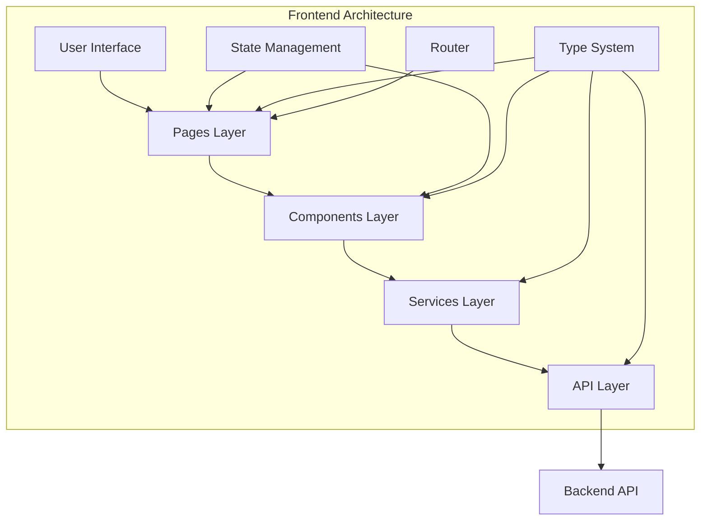
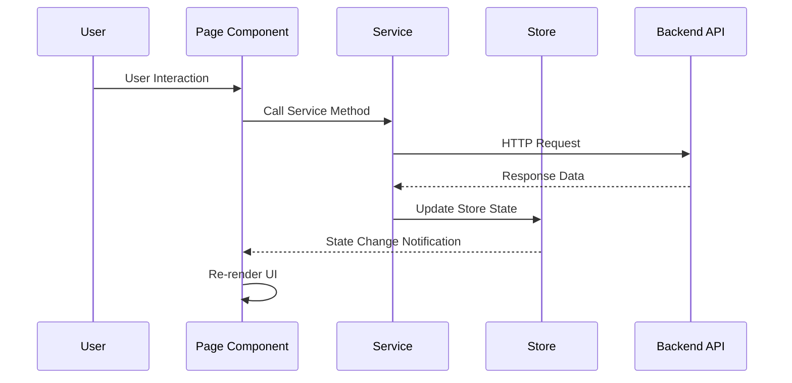
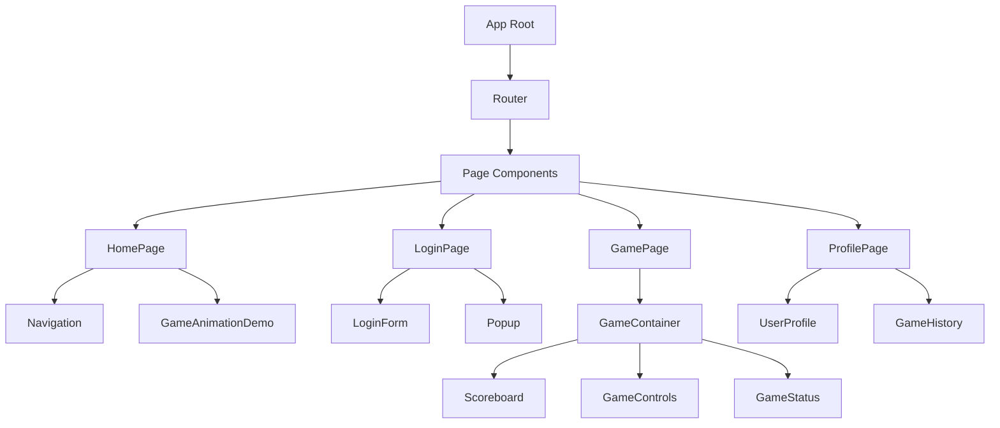
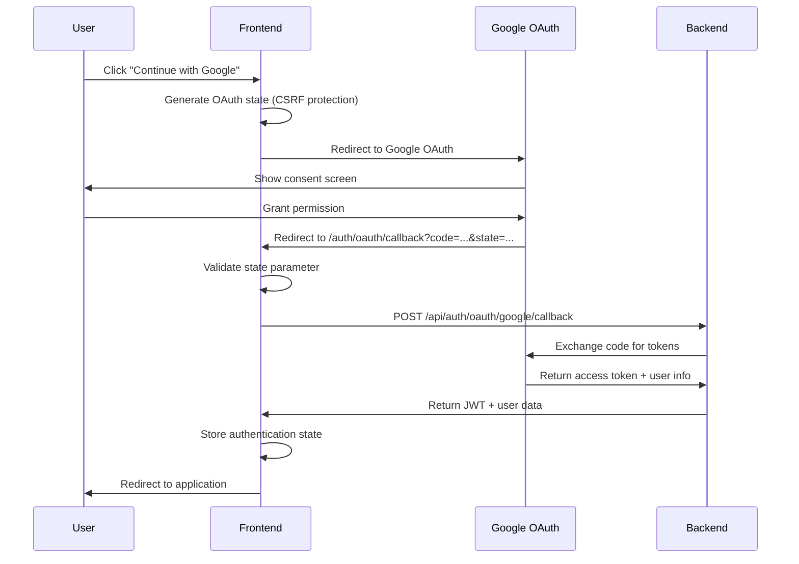

# Frontend Application Documentation

## 📑 Table of Contents

1. [Architecture Overview](#1-architecture-overview)
2. [Code Logic Deep Dive](#2-code-logic-deep-dive)
3. [API Documentation](#3-api-documentation)

---

## 1. Architecture Overview

### 🎯 Core Design Philosophy

The ft_transcendence frontend is built as a **Modern TypeScript Single Page Application (SPA)** following these core principles:

- **Type Safety First**: Comprehensive TypeScript coverage with strict typing
- **Component-Based Architecture**: Modular, reusable UI components
- **Centralized State Management**: Custom lightweight state stores
- **Browser-Native Routing**: No external router dependencies
- **API-First Design**: Clean separation between frontend and backend
- **Modern Error Handling**: Tuple-based `catchErrorTyped` pattern for consistent error management
- **Performance Optimized**: Lazy loading and efficient rendering

### 🏗️ High-Level Architecture



### 📁 Project Structure

```
src/
├── components/          # Reusable UI components
│   ├── base/           # Base component classes
│   ├── ui/             # Generic UI components (Button, Modal, etc.)
│   └── game/           # Game-specific components
├── pages/              # Route-level page components
│   ├── auth/           # Authentication pages (Login, OAuth callback)
│   ├── game/           # Game-related pages
│   ├── home/           # Landing page
│   ├── profile/        # User profile pages
│   └── friends/        # Friends management pages
├── services/           # Business logic and API communication
│   ├── api/            # HTTP API services
│   ├── auth/           # Authentication logic (JWT + OAuth)
│   ├── websocket/      # Real-time communication
│   └── error/          # Error handling
├── stores/             # State management
│   ├── app.store.ts    # Global application state
│   ├── auth.store.ts   # Authentication state
│   ├── game.store.ts   # Game session state
│   └── ui.store.ts     # UI state (modals, notifications)
├── types/              # TypeScript type definitions
│   ├── global.types.ts # Core entity types (User, Game)
│   ├── api.types.ts    # API request/response types
│   ├── game.types.ts   # Game logic types
│   ├── user.types.ts   # User profile types
│   ├── router.types.ts # Routing types
│   └── store.types.ts  # State management types
├── router/             # SPA routing system
└── assets/             # Static assets and utilities
```

### 🔄 Data Flow Architecture



### 🎨 Component Hierarchy



---

## 2. Code Logic Deep Dive

### 🏷️ Types System

#### **Philosophy & Design**
The type system is designed around **domain-driven design** with clear separation of concerns:

- **Global Types**: Core business entities (User, Game, Tournament)
- **API Types**: Request/response interfaces
- **Game Types**: Real-time game state and events
- **Store Types**: Application state structures
- **Router Types**: Navigation and routing

#### **Type Organization**

```typescript
// Central barrel export for clean imports
// src/types/index.ts
export * from './global.types'
export * from './api.types'
export * from './game.types'
export * from './user.types'
export * from './router.types'

// Usage throughout application
import type { User, Game, ApiResponse } from '@/types'
```

#### **Key Type Patterns**

**1. Generic API Responses**
```typescript
interface ApiResponse<T = any> {
  data: T
  success: boolean
  message?: string
  timestamp: number
  errorCode?: number
}

// Usage with type safety
const userResponse: ApiResponse<User> = await userService.getProfile()
```

**2. Discriminated Unions for Game States**
```typescript
type GameStatus = 'waiting' | 'starting' | 'playing' | 'paused' | 'finished'
type GameMode = 'singleplayer' | 'tournament' | 'ai'

interface GameState {
  ball: BallState
  paddles: PaddleState
  score: Score
  status: GameStatus
  gameId?: string
}
```

**3. Strict User Interfaces**
```typescript
interface User {
  id: string
  username: string
  email: string
  displayName?: string
  avatar?: string
  isOnline: boolean
  createdAt: Date
  lastSeen?: Date
}

interface UserProfile extends User {
  stats: UserStats
  achievements: Achievement[]
  recentGames: GameHistory[]
}
```

#### **Type Safety Benefits**
- **Compile-time Error Detection**: Catch type mismatches before runtime
- **IntelliSense Support**: Better developer experience with autocomplete
- **Refactoring Safety**: Changes propagate through type system
- **API Contract Enforcement**: Ensure frontend/backend compatibility

### 🏪 Stores (State Management)

#### **Architecture Philosophy**
Custom lightweight state management without external dependencies:

- **Single Source of Truth**: Centralized state for each domain
- **Immutable Updates**: Always create new state objects
- **Subscription Pattern**: Components subscribe to state changes
- **Type Safety**: Fully typed state and operations

#### **Base Store Implementation**

```typescript
// src/stores/BaseStore.ts
export class BaseStore<T> {
  private state: T
  private listeners: Set<(state: T) => void> = new Set()

  constructor(initialState: T) {
    this.state = initialState
  }

  subscribe(listener: (state: T) => void): () => void {
    this.listeners.add(listener)
    return () => this.listeners.delete(listener)
  }

  protected setState(updates: Partial<T>): void {
    this.state = { ...this.state, ...updates }
    this.notifyListeners()
  }

  getState(): T {
    return this.state
  }

  private notifyListeners(): void {
    this.listeners.forEach(listener => listener(this.state))
  }
}
```

#### **Store Implementations**

**1. Authentication Store**
```typescript
// src/stores/auth.store.ts
interface AuthState {
  isAuthenticated: boolean
  user: AuthUser | null
  token: string | null
  expiresAt: number | null
  loading: boolean
  error: string | null
}

class AuthStore extends BaseStore<AuthState> {
  async login(credentials: LoginCredentials): Promise<void>
  async logout(): Promise<void>
  refreshToken(): void
  clearError(): void
}
```

**2. Game Store**
```typescript
// src/stores/game.store.ts
interface GameState {
  currentGame: GameSession | null
  gameMode: GameMode
  isPlaying: boolean
  status: GameStatus
  loading: boolean
  error: string | null
}

class GameStore extends BaseStore<GameState> {
  createGame(settings: GameSettings): Promise<void>
  joinGame(gameId: string): Promise<void>
  updateGameState(updates: Partial<GameSession>): void
  endGame(): void
}
```

**3. UI Store**
```typescript
// src/stores/ui.store.ts
interface UIState {
  isMobile: boolean
  breakpoint: 'mobile' | 'tablet' | 'desktop'
  sidebarOpen: boolean
  activeModal: string | null
  notifications: UINotification[]
  theme: 'dark' | 'light'
}

class UIStore extends BaseStore<UIState> {
  showModal(modalId: string): void
  hideModal(): void
  addNotification(notification: UINotification): void
  removeNotification(id: string): void
  toggleSidebar(): void
  setTheme(theme: 'dark' | 'light'): void
}
```

#### **Store Usage in Components**

```typescript
// Component subscribing to store changes
export class LoginPage extends Component {
  private unsubscribeAuth: (() => void) | null = null

  afterMount(): void {
    // Subscribe to auth state changes
    this.unsubscribeAuth = authStore.subscribe((authState) => {
      if (authState.isAuthenticated) {
        router.navigate('/')
      }
      this.setState({ loading: authState.loading })
    })
  }

  beforeUnmount(): void {
    // Clean up subscription
    if (this.unsubscribeAuth) {
      this.unsubscribeAuth()
    }
  }

  private async handleLogin(credentials: LoginCredentials): Promise<void> {
    await authStore.login(credentials)
  }
}
```

### 🔧 Services Layer

#### **Service Architecture**
Services handle all business logic and external communication:

- **API Services**: HTTP communication with backend
- **Authentication**: User session management
- **Error Handling**: Centralized error processing

#### **Base API Service**

```typescript
// src/services/api/BaseApiService.ts
export class ApiService {
  private baseUrl: string
  private timeout: number

  constructor(baseUrl = 'http://localhost:8000/api', timeout = 5000) {
    this.baseUrl = baseUrl
    this.timeout = timeout
  }

  private async makeRequest<T>(
    endpoint: string,
    options: RequestInit = {}
  ): Promise<ApiResponse<T>> {
    const url = `${this.baseUrl}${endpoint}`
    
    try {
      const controller = new AbortController()
      const timeoutId = setTimeout(() => controller.abort(), this.timeout)
      
      const response = await fetch(url, {
        ...options,
        signal: controller.signal,
        headers: {
          'Content-Type': 'application/json',
          ...options.headers,
        },
      })

      clearTimeout(timeoutId)

      if (!response.ok) {
        throw new Error(`HTTP ${response.status}: ${response.statusText}`)
      }

      const data = await response.json()
      return {
        data,
        success: true,
        timestamp: Date.now(),
        status: response.status
      }
    } catch (error) {
      throw this.handleError(error)
    }
  }
}
```

#### **Specific Service Implementations**

**1. Authentication Service**
```typescript
// src/services/auth/AuthService.ts
export class AuthService extends ApiService {
  // JWT Authentication
  async login(credentials: LoginCredentials): Promise<AuthResponse>
  async register(userData: RegisterCredentials): Promise<AuthResponse>
  async logout(): Promise<void>
  async refreshToken(): Promise<string>
  
  // OAuth 2.0 Authentication
  async startGoogleOAuth(returnTo?: string): Promise<void>
  async handleOAuthCallback(searchParams: URLSearchParams): Promise<AuthResponse>
  async linkGoogleAccount(): Promise<void>
  isOAuthAvailable(): boolean
}
```

#### **OAuth 2.0 Integration**

The application supports Google OAuth 2.0 authentication as an alternative to traditional JWT login, providing users with a seamless sign-in experience.

##### **OAuth Architecture**



##### **OAuth Service Implementation**

```typescript
// src/services/auth/GoogleOAuthService.ts
export class GoogleOAuthService {
  private readonly config: OAuthConfig
  private readonly GOOGLE_AUTH_URL = 'https://accounts.google.com/o/oauth2/v2/auth'
  
  constructor() {
    this.config = {
      clientId: import.meta.env.VITE_GOOGLE_CLIENT_ID || '',
      redirectUri: window.location.origin + import.meta.env.VITE_GOOGLE_REDIRECT_URI,
      scope: ['openid', 'email', 'profile']
    }
  }

  /**
   * @brief Start OAuth authorization flow
   * Redirects user to Google OAuth consent screen
   */
  public startOAuthFlow(returnTo?: string): void {
    const authUrl = this.generateAuthUrl(returnTo)
    window.location.href = authUrl
  }

  /**
   * @brief Complete OAuth flow on callback
   * Processes authorization code and exchanges for tokens
   */
  public async completeOAuthFlow(searchParams: URLSearchParams): Promise<{
    profile: GoogleProfile
    tokens: OAuthTokenResponse
    returnTo?: string
  }> {
    const code = searchParams.get('code')
    const state = searchParams.get('state')
    
    // Validate OAuth state for CSRF protection
    this.validateOAuthState(state)
    
    // Exchange authorization code for access token
    const tokens = await this.exchangeCodeForToken(code, state)
    
    // Fetch user profile information
    const profile = await this.fetchUserProfile(tokens.access_token)
    
    return { profile, tokens, returnTo: this.getReturnUrl(state) }
  }

  /**
   * @brief Generate secure OAuth authorization URL
   */
  private generateAuthUrl(returnTo?: string): string {
    const oauthState = this.generateState(returnTo)
    this.storeOAuthState(oauthState)

    const params = new URLSearchParams({
      client_id: this.config.clientId,
      redirect_uri: this.config.redirectUri,
      response_type: 'code',
      scope: this.config.scope.join(' '),
      state: oauthState.state,
      access_type: 'offline',
      prompt: 'consent'
    })

    return `${this.GOOGLE_AUTH_URL}?${params.toString()}`
  }
}
```

##### **OAuth Route Configuration**

```typescript
// src/router/routes.ts - OAuth callback route
router.register('/auth/oauth/callback', async () => {
  console.log('🔗 Loading OAuth Callback page')
  loadPage(OAuthCallbackPage)
  document.title = 'OAuth Callback - ft_transcendence'
})
```

##### **OAuth Callback Page**

```typescript
// src/pages/auth/OAuthCallbackPage.ts
export class OAuthCallbackPage extends Component {
  /**
   * @brief Process OAuth callback automatically on mount
   */
  public async mount(container: HTMLElement): Promise<void> {
    container.innerHTML = this.render()
    await this.processOAuthCallback()
  }

  /**
   * @brief Process OAuth callback from URL parameters
   */
  private async processOAuthCallback(): Promise<void> {
    try {
      const urlParams = new URLSearchParams(window.location.search)
      
      // Handle OAuth callback through AuthService
      const result = await authService.handleOAuthCallback(urlParams)
      
      if (result.success && result.user) {
        this.setState({
          isProcessing: false,
          success: true,
          userInfo: result.user
        })
        
        // Redirect to intended page
        setTimeout(() => router.navigate('/'), 2000)
      }
    } catch (error) {
      this.handleOAuthError(error)
    }
  }
}
```

##### **OAuth Environment Configuration**

```bash
# src/.env - OAuth environment variables
VITE_GOOGLE_CLIENT_ID=your-google-client-id
VITE_GOOGLE_REDIRECT_URI=/auth/oauth/callback
VITE_OAUTH_ENABLED=true
```

##### **Google Cloud Console Setup**

**Required Configuration:**
- **Authorized JavaScript Origins**: `https://localhost` (or your domain)
- **Authorized Redirect URIs**: `https://localhost/auth/oauth/callback`

##### **OAuth Security Features**

1. **CSRF Protection**: State parameter validation
2. **Secure Token Storage**: Temporary sessionStorage for OAuth state
3. **Error Handling**: Comprehensive error states and user feedback
4. **Fallback Support**: Graceful degradation when OAuth unavailable

##### **OAuth Integration in Login Page**

```typescript
// src/pages/auth/LoginPage.ts - OAuth button integration
private renderLoginForm(): string {
  return `
    <!-- Traditional login form -->
    <form>...</form>
    
    <!-- OAuth Divider -->
    <div class="flex items-center space-x-4 my-4">
      <div class="flex-1 h-px bg-green-600"></div>
      <span class="text-green-400 text-sm">or</span>
      <div class="flex-1 h-px bg-green-600"></div>
    </div>
    
    <!-- Google OAuth Button -->
    <button
      type="button"
      data-oauth-google="true"
      class="w-full px-6 py-3 bg-white hover:bg-gray-100 text-gray-800 font-bold rounded-lg flex items-center justify-center space-x-2"
    >
      <svg class="w-5 h-5" viewBox="0 0 24 24">
        <!-- Google logo SVG -->
      </svg>
      <span>Continue with Google</span>
    </button>
  `
}

private async handleGoogleOAuth(): Promise<void> {
  try {
    if (!authService.isOAuthAvailable()) {
      throw new Error('Google OAuth is not available')
    }
    
    // Start OAuth flow - redirects to Google
    await authService.startGoogleOAuth('/')
  } catch (error) {
    showPopup(`Google OAuth failed: ${error.message}`)
  }
}
```

**2. User API Service**
```typescript
// src/services/api/UserApiService.ts
export class UserApiService extends ApiService {
  async getProfile(userId?: string): Promise<UserProfile> {
    const endpoint = userId ? `/users/${userId}` : '/users/me'
    
    const [error, response] = await catchErrorTyped(
      this.get<UserProfile>(endpoint)
    )

    if (error) {
      console.error('❌ Failed to get user profile:', error.message)
      throw new Error(error.message || 'Failed to load user profile')
    }

    return response!.data
  }

  async updateProfile(updates: UpdateUserRequest): Promise<UserProfile> {
    const [error, response] = await catchErrorTyped(
      this.patch<UserProfile>('/users/me', updates)
    )

    if (error) {
      console.error('❌ Failed to update profile:', error.message)
      throw new Error(error.message || 'Failed to update profile')
    }

    return response!.data
  }

  async getGameHistory(userId?: string): Promise<GameHistory[]> {
    const endpoint = userId ? `/users/${userId}/games` : '/users/me/games'
    
    const [error, response] = await catchErrorTyped(
      this.get<GameHistory[]>(endpoint)
    )

    if (error) {
      console.error('❌ Failed to get game history:', error.message)
      throw new Error(error.message || 'Failed to load game history')
    }

    return response!.data
  }
}
```

**3. Socket.IO WebSocket Service**

The frontend uses **Socket.IO client v4.8.1** for real-time communication, providing enhanced gaming features and reliable connections for the multiplayer pong experience.

```typescript
// src/services/websocket/WebSocketService.ts
export class WebSocketService {
  // Connection management
  async connect(token?: string): Promise<void>
  disconnect(): void
  isConnected(): boolean
  getConnectionState(): ConnectionState
  
  // Event handling
  on<K extends keyof WebSocketEvents>(event: K, handler: WebSocketEventHandler<WebSocketEvents[K]>): void
  off<K extends keyof WebSocketEvents>(event: K, handler: WebSocketEventHandler<WebSocketEvents[K]>): void
  emit(event: string, data: any): void
  
  // Room management
  joinRoom(roomId: string): void
  leaveRoom(roomId: string): void
  
  // Presence system
  subscribeToPresence(userIds: string[]): void
  unsubscribeFromPresence(userIds: string[]): void
  updateStatus(status: string): void
}
```

##### **Socket.IO Configuration**

The WebSocket service is configured with the following settings:

```typescript
// Connection options
const socket = io(serverUrl, {
  transports: ['websocket'],          // WebSocket only (no polling fallback)
  timeout: 10000,                     // 10-second connection timeout
  auth: token ? { token } : undefined, // JWT authentication
  autoConnect: false,                 // Manual connection control
})
```

**⚠️ Configuration Issues Identified:**
- **Transport limitation**: Only WebSocket transport enabled, may fail in restrictive networks
- **No polling fallback**: Should include `['websocket', 'polling']` for better compatibility
- **Type mismatch**: Using `@types/socket.io-client` v3.0.0 with `socket.io-client` v4.8.1

##### **Socket.IO Integration Benefits**

- **Type Safety**: Full TypeScript event definitions for all real-time events
- **Authentication**: JWT token-based connection authentication
- **Room Support**: Native room joining/leaving for game sessions
- **Connection State**: Real-time connection state monitoring
- **Error Handling**: Comprehensive error handling with timeouts

##### **Real-time Event Categories**

```typescript
export interface SocketEvents {
  // Friend system events
  'friend:request_received': { requestId: string, fromUser: any }
  'friend:request_accepted': { requestId: string, user: any }
  'friend:request_declined': { requestId: string }
  'friend:removed': { userId: string }
  
  // Online status events
  'user:online': { userId: string, status: string }
  'user:offline': { userId: string, lastSeen: string }
  'user:status_update': { status: string }
  'user:status_change': { userId: string, status: string, lastSeen?: string }
  
  // Connection events
  'connection:state_change': { state: ConnectionState }
  'connection:error': { error: string, code?: string }
  
  // Notification events
  'notification:send': { notification: any }
  'notification:received': { notification: any }
  'notification:read': { notificationId: string }
  'notification:delete': { notificationId: string }
  'notification:deleted': { notificationId: string }
  'notification:bulk_read': { notificationIds: string[] }
  
  // Game events (DEFINED BUT NOT IMPLEMENTED)
  'game:create': { gameConfig: any }
  'game:join': { gameId: string }
  'game:leave': { gameId: string }
  'game:ready': { gameId: string }
  'game:start': { gameId: string, gameState: any }
  'game:move': { gameId: string, move: any }
  'game:update': { gameId: string, gameState: any }
  'game:end': { gameId: string, result: any }
  'game:pause': { gameId: string }
  'game:resume': { gameId: string }
  
  // Tournament events (DEFINED BUT NOT IMPLEMENTED)
  'tournament:create': { tournamentConfig: any }
  'tournament:join': { tournamentId: string }
  'tournament:leave': { tournamentId: string }
  'tournament:start': { tournamentId: string }
  'tournament:match_start': { tournamentId: string, matchId: string }
  'tournament:match_end': { tournamentId: string, matchId: string, result: any }
  'tournament:update': { tournamentId: string, tournament: any }
  'tournament:end': { tournamentId: string, winner: any }
  
  // Chat events (DEFINED BUT NOT IMPLEMENTED)
  'chat:join': { roomId: string }
  'chat:leave': { roomId: string }
  'chat:message': { roomId: string, message: string }
  'chat:message_received': { roomId: string, message: any }
  'chat:typing': { roomId: string, isTyping: boolean }
  'chat:user_typing': { roomId: string, userId: string, isTyping: boolean }
}
```

##### **Current Implementation Status**

**✅ Fully Implemented:**
- **Notification System**: Complete real-time notification handling
- **Friends System**: Real-time friend requests and presence updates
- **Connection Management**: Robust connection state tracking

**❌ Missing Implementation:**
- **✅ Game Events**: Game store now has **COMPLETE** WebSocket integration with real-time multiplayer
- **Tournament Events**: Defined but not used anywhere in the codebase
- **Chat System**: Complete events defined but no implementation

##### **Usage Examples**

**Notification System:**
```typescript
// NotificationService automatically sets up listeners
webSocketService.on('notification:received', (data) => {
  this.handleNotificationReceived(data.notification)
})

// Send read confirmation
webSocketService.emit('notification:read', { notificationId })
```

**Friends System:**
```typescript
// FriendsStore handles presence updates
webSocketService.on('user:online', (data) => {
  this.updateFriendStatus(data.userId, true, data.status)
})

webSocketService.on('friend:request_received', (data) => {
  console.log('📨 Friend request received:', data)
})

// Subscribe to friend presence
webSocketService.subscribeToPresence(['user123', 'user456'])
```

**Real-time Game System:**
```typescript
// GameService - Initialize real-time game connection
await gameService.initializeRealTimeConnection(authToken)

// Join a game room for real-time updates
await gameService.joinGameRoom('game-123')

// Send player moves
gameService.sendPlayerMove({
  paddlePosition: 75,
  playerId: 'player-1',
  timestamp: Date.now()
})

// GameStore - Automatic WebSocket event handling
// Game started
gameStore.handleGameStarted(event) // Handles game:started events

// Real-time game state updates
gameStore.handleGameStateUpdated(event) // Handles game:state_updated events

// Player moves
gameStore.handleMoveReceived(event) // Handles game:move_received events
```

**Game Error Handling:**
```typescript
// GameService - All methods now use catchErrorTyped
const [error, result] = await catchErrorTyped(
  gameService.joinGameRoom('game-123')
)

if (error) {
  console.error('Failed to join game room:', error.message)
  gameStore.setError(error.message)
}

// GameStore - Event handlers use simple error checks
gameStore.handleGameStarted(event) // Handles game:started events
gameStore.handleGameStateUpdated(event) // Real-time updates

// Centralized error handling
gameStore.setError(error.message)
```

**Connection Management:**
```typescript
// Connect with authentication
await webSocketService.connect(authToken)

// Monitor connection state
webSocketService.on('connection:state_change', (data) => {
  console.log('Connection state:', data.state)
})
```

##### **Backend Requirements**

The frontend expects the backend to implement these WebSocket features:

**Authentication:**
- JWT token validation on connection via `auth.token`
- User session management with presence tracking

**Event Emission:**
- All events must follow the defined `SocketEvents` interface
- Error events should include `{ error: string, code?: string }`

**Room Management:**
- Support for `join` and `leave` events with room IDs
- Presence subscription/unsubscription for user lists

**Required Server Events:**
```typescript
// Must be implemented by backend
'notification:received' | 'notification:read' | 'notification:deleted'
'friend:request_received' | 'friend:request_accepted' | 'user:online' | 'user:offline'
'connection:state_change' | 'connection:error'

// Should be implemented for gaming features
'game:start' | 'game:move' | 'game:update' | 'game:end'
```

##### **WebSocket System Integration**

**Services Using WebSocket:**
- ✅ `NotificationService`: Complete integration
- ✅ `FriendsService`: Real-time updates via FriendsStore
- ❌ `GameService`: **No WebSocket integration** 

**Stores Using WebSocket:**
- ✅ `FriendsStore`: Comprehensive presence and friend event handling
- ❌ `GameStore`: **Missing real-time game functionality**
- ❌ `AuthStore`: No presence broadcasting
- ❌ `UIStore`: No real-time UI synchronization

> **⚠️ Critical Gap**: The game system lacks real-time WebSocket integration, which is essential for multiplayer pong gameplay. This should be the highest priority for implementation.

#### **Error Handling Strategy**

The frontend uses a modern **catchErrorTyped** function for consistent, type-safe error handling across all services and components.

```typescript
// src/services/error/index.ts
export async function catchErrorTyped<T>(
  promise: Promise<T>
): Promise<[Error | null, T | undefined]> {
  try {
    const result = await promise
    return [null, result]
  } catch (error) {
    return [error instanceof Error ? error : new Error(String(error)), undefined]
  }
}
```

#### **Error Handling Pattern**

**Services use catchErrorTyped:**
```typescript
// Service method example
public async getUserProfile(userId?: string): Promise<UserProfile> {
  const endpoint = userId ? `/users/${userId}` : '/users/me'
  
  const [error, response] = await catchErrorTyped(
    this.get<UserProfile>(endpoint)
  )

  if (error) {
    console.error('❌ Failed to get user profile:', error.message)
    throw new Error(error.message || 'Failed to load user profile')
  }

  return response!.data
}
```

**Pages/Components catch and display errors:**
```typescript
// Page/Component usage
private async loadUserData(): Promise<void> {
  try {
    const profile = await userApiService.getUserProfile()
    this.setState({ profile })
  } catch (error) {
    const message = error instanceof Error ? error.message : 'Unknown error'
    showPopup(message)
    this.setState({ error: message })
  }
}
```

#### **Error Handling Benefits**

- **Type Safety**: Tuple-based error handling prevents unhandled exceptions
- **Consistent Pattern**: All services use the same error handling approach
- **User-Friendly Messages**: Errors are converted to readable messages
- **Centralized Logging**: All errors are logged with context
- **No Silent Failures**: Errors must be explicitly handled
```

### 🧭 Router System

#### **Router Philosophy**
Custom browser-native routing without external dependencies:

- **History API**: Clean URLs without hashes
- **Type Safety**: Fully typed route configurations
- **Route Guards**: Authentication and authorization
- **Parameter Extraction**: Automatic URL parameter parsing

#### **Core Router Implementation**

```typescript
// src/router/router.ts
export class Router {
  private routes: Map<string, RouteConfig> = new Map()
  private currentRoute: string = ''
  private listeners: Set<RouteChangeListener> = new Set()

  constructor(private options: RouterOptions = {}) {
    this.setupEventListeners()
  }

  register(path: string, handler: RouteHandler, options: Partial<RouteConfig> = {}): void {
    const route: RouteConfig = {
      path,
      handler,
      requiresAuth: options.requiresAuth || false,
      redirect: options.redirect,
      title: options.title,
      meta: options.meta || {}
    }

    this.routes.set(path, route)
  }

  async navigate(path: string, options: NavigationOptions = {}): Promise<void> {
    if (path === this.currentRoute) return

    const route = this.findMatchingRoute(path)
    if (!route) {
      console.warn(`No route found for path: ${path}`)
      await this.navigate('/404')
      return
    }

    if (!this.canAccessRoute(route)) {
      await this.navigate(route.redirect || '/login')
      return
    }

    const previousRoute = this.currentRoute
    this.currentRoute = path

    // Update browser history
    if (options.replace) {
      history.replaceState({ path }, '', path)
    } else {
      history.pushState({ path }, '', path)
    }

    // Update document title
    if (route.title) {
      document.title = route.title
    }

    // Execute route handler
    await this.executeRoute(route, path)

    // Notify listeners
    this.notifyRouteChange({
      from: previousRoute,
      to: path,
      params: this.extractParams(route.path, path),
      query: this.extractQuery(path)
    })
  }

  private findMatchingRoute(path: string): RouteConfig | null {
    // Exact match first
    if (this.routes.has(path)) {
      return this.routes.get(path)!
    }

    // Parameter matching
    for (const [routePath, route] of this.routes) {
      if (this.pathMatches(routePath, path)) {
        return route
      }
    }

    return null
  }

  private extractParams(routePath: string, actualPath: string): Record<string, string> {
    const routeParts = routePath.split('/')
    const actualParts = actualPath.split('/')
    const params: Record<string, string> = {}

    for (let i = 0; i < routeParts.length; i++) {
      const routePart = routeParts[i]
      if (routePart.startsWith(':')) {
        const paramName = routePart.slice(1)
        params[paramName] = actualParts[i] || ''
      }
    }

    return params
  }
}
```

#### **Route Configuration**

```typescript
// src/router/routes.ts
export const setupRoutes = (router: Router): void => {
  // Public routes
  router.register('/', homeHandler, {
    title: 'ft_transcendence - Home'
  })

  router.register('/login', authHandler, {
    title: 'Login - ft_transcendence'
  })

  // Protected routes
  router.register('/game', gameHandler, {
    requiresAuth: true,
    title: 'Game Lobby'
  })

  router.register('/game/play', gamePlayHandler, {
    requiresAuth: true,
    title: 'Playing Pong'
  })

  router.register('/profile', profileHandler, {
    requiresAuth: true,
    title: 'Profile'
  })

  router.register('/profile/:userId', userProfileHandler, {
    requiresAuth: true,
    title: 'User Profile'
  })

  // Fallback route
  router.register('/404', notFoundHandler, {
    title: 'Page Not Found'
  })
}
```

### 📄 Pages Architecture

#### **Page Design Philosophy**
Pages are top-level route components that:

- **Own Route Logic**: Handle URL parameters and query strings
- **Manage Page State**: Loading, error, and data states
- **Coordinate Services**: Orchestrate API calls and state updates
- **Compose Components**: Combine smaller components into full pages

#### **Base Page Class**

```typescript
// src/pages/base/BasePage.ts
export abstract class BasePage<TProps = {}, TState = {}> extends Component<TProps, TState> {
  protected loading: boolean = false
  protected error: string | null = null

  async init(): Promise<void> {
    this.setLoading(true)
    try {
      await this.loadData()
    } catch (error) {
      console.error('Page initialization error:', error)
      this.setError(error instanceof Error ? error.message : 'Unknown error')
    } finally {
      this.setLoading(false)
    }
  }

  protected abstract loadData(): Promise<void>

  protected setLoading(loading: boolean): void {
    this.loading = loading
    this.rerender()
  }

  protected setError(error: string | null): void {
    this.error = error
    this.rerender()
  }

  protected renderLoadingState(): string {
    return `
      <div class="flex items-center justify-center min-h-screen">
        <div class="text-green-400">Loading...</div>
      </div>
    `
  }

  protected renderErrorState(): string {
    return `
      <div class="flex items-center justify-center min-h-screen">
        <div class="text-red-400">Error: ${this.error}</div>
      </div>
    `
  }
}
```

#### **Page Implementations**

**1. HomePage**
```typescript
// src/pages/home/HomePage.ts
export class HomePage extends BasePage<HomePageProps, HomePageState> {
  constructor(props: HomePageProps = {}) {
    super(props, {
      isAuthenticated: false,
      recentGames: [],
      leaderboard: []
    })
  }

  protected async loadData(): Promise<void> {
    // Check authentication status
    const authState = authStore.getState()
    this.setState({ isAuthenticated: authState.isAuthenticated })

    if (authState.isAuthenticated) {
      // Load user-specific data
      try {
        const [recentGames, leaderboard] = await Promise.all([
          userApiService.getGameHistory(),
          gameApiService.getLeaderboard()
        ])
        
        this.setState({ recentGames, leaderboard })
      } catch (error) {
        console.error('Failed to load user data:', error)
      }
    }
  }

  render(): string {
    if (this.loading) return this.renderLoadingState()
    if (this.error) return this.renderErrorState()

    const { isAuthenticated, recentGames, leaderboard } = this.state

    return `
      <div class="min-h-screen bg-black text-green-400">
        <nav class="navbar">
          <!-- Navigation component -->
        </nav>
        
        <main class="container mx-auto px-4 py-8">
          ${isAuthenticated 
            ? this.renderAuthenticatedView()
            : this.renderGuestView()
          }
        </main>
      </div>
    `
  }

  private renderAuthenticatedView(): string {
    return `
      <div class="grid grid-cols-1 lg:grid-cols-2 gap-8">
        <section>
          <h2>Quick Play</h2>
          <!-- Game mode selection -->
        </section>
        
        <section>
          <h2>Recent Games</h2>
          <!-- Recent games list -->
        </section>
      </div>
    `
  }

  private renderGuestView(): string {
    return `
      <div class="text-center">
        <h1>Welcome to ft_transcendence</h1>
        <p>Experience the classic Pong game online</p>
        
        <div class="mt-8">
          <a href="/login" class="btn btn-primary">Get Started</a>
        </div>
        
        <!-- Game demo animation -->
        <div id="game-demo" class="mt-12">
          <!-- GameAnimationDemo component -->
        </div>
      </div>
    `
  }
}
```

**2. GamePage**
```typescript
// src/pages/game/GamePage.ts
export class GamePage extends BasePage<GamePageProps, GamePageState> {
  private gameContainer: GameContainer | null = null

  constructor(props: GamePageProps = {}) {
    super(props, {
      gameMode: 'lobby',
      currentGame: null,
      availableGames: []
    })
  }

  protected async loadData(): Promise<void> {
    try {
      const availableGames = await gameApiService.getAvailableGames()
      this.setState({ availableGames })
    } catch (error) {
      console.error('Failed to load available games:', error)
    }
  }

  afterMount(): void {
    super.afterMount()
    
    // Initialize game container
    const gameContainerElement = this.element?.querySelector('#game-container')
    if (gameContainerElement) {
      this.gameContainer = new GameContainer({
        mode: this.state.gameMode
      })
      this.gameContainer.mount(gameContainerElement as HTMLElement)
    }

    // Subscribe to game store
    gameStore.subscribe(this.handleGameStateChange.bind(this))
  }

  private handleGameStateChange(gameState: GameState): void {
    this.setState({
      currentGame: gameState.currentGame,
      gameMode: gameState.isPlaying ? 'playing' : 'lobby'
    })

    if (this.gameContainer) {
      this.gameContainer.updateProps({
        mode: this.state.gameMode
      })
    }
  }

  render(): string {
    if (this.loading) return this.renderLoadingState()
    if (this.error) return this.renderErrorState()

    const { gameMode, currentGame, availableGames } = this.state

    return `
      <div class="min-h-screen bg-black text-green-400">
        <div class="container mx-auto px-4 py-8">
          ${gameMode === 'lobby' 
            ? this.renderLobby()
            : this.renderGame()
          }
        </div>
      </div>
    `
  }

  private renderLobby(): string {
    return `
      <div class="grid grid-cols-1 lg:grid-cols-3 gap-8">
        <section class="lg:col-span-2">
          <h1>Game Lobby</h1>
          <div id="game-container"></div>
        </section>
        
        <aside>
          <h2>Available Games</h2>
          <!-- Available games list -->
          
          <div class="mt-6">
            <button id="create-game" class="btn btn-primary w-full">
              Create New Game
            </button>
          </div>
        </aside>
      </div>
    `
  }

  private renderGame(): string {
    return `
      <div class="game-view">
        <div id="game-container" class="w-full h-full"></div>
      </div>
    `
  }
}
```

### 🧩 Components Architecture

#### **Component Design Philosophy**
Components are designed as **self-contained, reusable UI units**:

- **Single Responsibility**: Each component has one clear purpose
- **Props Interface**: Clean API for external configuration
- **State Management**: Internal state for UI concerns only
- **Event Emission**: Communicate with parents through events
- **Composition**: Build complex UIs from simple components

#### **Base Component System**

```typescript
// src/components/base/Component.ts
export abstract class Component<TProps = {}, TState = {}> {
  protected element: HTMLElement | null = null
  protected props: TProps
  protected state: TState
  protected mounted: boolean = false

  constructor(props: TProps, initialState: TState) {
    this.props = props
    this.state = initialState
  }

  abstract render(): string

  mount(parent: HTMLElement): void {
    const html = this.render()
    const template = document.createElement('template')
    template.innerHTML = html.trim()
    this.element = template.content.firstElementChild as HTMLElement
    
    parent.appendChild(this.element)
    this.mounted = true
    this.afterMount()
  }

  unmount(): void {
    if (this.element && this.element.parentNode) {
      this.beforeUnmount()
      this.element.parentNode.removeChild(this.element)
      this.mounted = false
    }
  }

  updateProps(newProps: Partial<TProps>): void {
    this.props = { ...this.props, ...newProps }
    this.rerender()
  }

  protected setState(stateUpdates: Partial<TState>): void {
    this.state = { ...this.state, ...stateUpdates }
    this.rerender()
  }

  protected afterMount(): void {}
  protected beforeUnmount(): void {}

  protected rerender(): void {
    if (this.mounted && this.element) {
      const newHtml = this.render()
      const newElement = document.createElement('template')
      newElement.innerHTML = newHtml.trim()
      const replacement = newElement.content.firstElementChild as HTMLElement
      
      this.element.parentNode?.replaceChild(replacement, this.element)
      this.element = replacement
      this.afterMount()
    }
  }

  protected addEventListener(event: string, handler: EventListener): void {
    if (this.element) {
      this.element.addEventListener(event, handler)
    }
  }

  protected emit(eventName: string, detail: any = {}): void {
    if (this.element) {
      const event = new CustomEvent(eventName, { detail, bubbles: true })
      this.element.dispatchEvent(event)
    }
  }
}
```

#### **UI Component Examples**

**1. Button Component**
```typescript
// src/components/ui/Button.ts
export interface ButtonProps {
  text: string
  variant: 'primary' | 'secondary' | 'game' | 'danger'
  size?: 'sm' | 'md' | 'lg'
  disabled?: boolean
  onClick?: () => void
  className?: string
}

export class Button extends Component<ButtonProps, {}> {
  constructor(props: ButtonProps) {
    super(props, {})
  }

  afterMount(): void {
    this.addEventListener('click', this.handleClick.bind(this))
  }

  private handleClick(event: Event): void {
    event.preventDefault()
    if (!this.props.disabled && this.props.onClick) {
      this.props.onClick()
    }
  }

  render(): string {
    const { text, variant, size = 'md', disabled, className = '' } = this.props

    const baseClasses = 'font-bold rounded-lg transition-all transform hover:scale-105 focus:outline-none focus:ring-2'
    const variantClasses = {
      primary: 'bg-green-600 hover:bg-green-500 text-black focus:ring-green-400',
      secondary: 'bg-gray-600 hover:bg-gray-500 text-white focus:ring-gray-400',
      game: 'bg-blue-600 hover:bg-blue-500 text-white focus:ring-blue-400',
      danger: 'bg-red-600 hover:bg-red-500 text-white focus:ring-red-400'
    }
    const sizeClasses = {
      sm: 'px-3 py-1 text-sm',
      md: 'px-4 py-2',
      lg: 'px-6 py-3 text-lg'
    }

    const classes = [
      baseClasses,
      variantClasses[variant],
      sizeClasses[size],
      disabled ? 'opacity-50 cursor-not-allowed' : '',
      className
    ].filter(Boolean).join(' ')

    return `
      <button 
        class="${classes}"
        ${disabled ? 'disabled' : ''}
        type="button"
      >
        ${text}
      </button>
    `
  }
}
```

**2. Modal Component**
```typescript
// src/components/ui/Modal.ts
export interface ModalProps {
  title: string
  isOpen: boolean
  onClose: () => void
  children: string
  size?: 'sm' | 'md' | 'lg' | 'xl'
  closeOnOverlay?: boolean
}

export interface ModalState {
  animationState: 'entering' | 'visible' | 'exiting' | 'hidden'
}

export class Modal extends Component<ModalProps, ModalState> {
  constructor(props: ModalProps) {
    super(props, {
      animationState: props.isOpen ? 'visible' : 'hidden'
    })
  }

  afterMount(): void {
    if (this.props.isOpen) {
      this.show()
    }

    this.addEventListener('click', this.handleOverlayClick.bind(this))
    document.addEventListener('keydown', this.handleKeyDown.bind(this))
  }

  beforeUnmount(): void {
    document.removeEventListener('keydown', this.handleKeyDown.bind(this))
  }

  updateProps(newProps: Partial<ModalProps>): void {
    const wasOpen = this.props.isOpen
    super.updateProps(newProps)
    
    if (!wasOpen && this.props.isOpen) {
      this.show()
    } else if (wasOpen && !this.props.isOpen) {
      this.hide()
    }
  }

  private show(): void {
    this.setState({ animationState: 'entering' })
    setTimeout(() => {
      this.setState({ animationState: 'visible' })
    }, 10)
  }

  private hide(): void {
    this.setState({ animationState: 'exiting' })
    setTimeout(() => {
      this.setState({ animationState: 'hidden' })
      if (this.props.onClose) {
        this.props.onClose()
      }
    }, 300)
  }

  private handleOverlayClick(event: Event): void {
    if (event.target === this.element && this.props.closeOnOverlay !== false) {
      this.hide()
    }
  }

  private handleKeyDown(event: KeyboardEvent): void {
    if (event.key === 'Escape' && this.props.isOpen) {
      this.hide()
    }
  }

  render(): string {
    const { title, children, size = 'md' } = this.props
    const { animationState } = this.state

    if (animationState === 'hidden' && !this.props.isOpen) {
      return '<div style="display: none;"></div>'
    }

    const sizeClasses = {
      sm: 'max-w-sm',
      md: 'max-w-md',
      lg: 'max-w-lg',
      xl: 'max-w-xl'
    }

    const overlayClasses = `
      fixed inset-0 bg-black/70 backdrop-blur-sm z-50 flex items-center justify-center p-4
      transition-opacity duration-300 ease-out
      ${animationState === 'entering' ? 'opacity-0' : ''}
      ${animationState === 'visible' ? 'opacity-100' : ''}
      ${animationState === 'exiting' ? 'opacity-0' : ''}
    `

    const modalClasses = `
      relative w-full ${sizeClasses[size]} bg-gray-900 border border-green-600 rounded-xl shadow-2xl
      transform transition-all duration-300 ease-out
      ${animationState === 'entering' ? 'scale-95 translate-y-4 opacity-0' : ''}
      ${animationState === 'visible' ? 'scale-100 translate-y-0 opacity-100' : ''}
      ${animationState === 'exiting' ? 'scale-95 translate-y-4 opacity-0' : ''}
    `

    return `
      <div class="${overlayClasses}">
        <div class="${modalClasses}">
          <header class="flex items-center justify-between p-6 border-b border-green-600">
            <h2 class="text-xl font-bold text-green-400">${title}</h2>
            <button class="text-gray-400 hover:text-gray-300 transition-colors">
              ✕
            </button>
          </header>
          
          <div class="p-6">
            ${children}
          </div>
        </div>
      </div>
    `
  }
}
```

#### **Game Component Examples**

**1. GameContainer**
```typescript
// src/components/game/GameContainer.ts
export interface GameContainerProps {
  mode?: 'lobby' | 'playing'
  className?: string
}

export interface GameContainerState {
  gameState: GameStatus | 'lobby'
  score: Score
  vsAI: boolean
  player1Score: number
  player2Score: number
}

export class GameContainer extends Component<GameContainerProps, GameContainerState> {
  constructor(props: GameContainerProps = {}) {
    super(props, {
      gameState: props.mode === 'playing' ? 'playing' : 'lobby',
      score: { player1: 0, player2: 0, maxScore: 5 },
      player1Score: 0,
      player2Score: 0,
      vsAI: false
    })
  }

  startGame(vsAI: boolean = false): void {
    this.setState({
      gameState: 'playing',
      vsAI,
      player1Score: 0,
      player2Score: 0,
      score: { player1: 0, player2: 0, maxScore: 5 }
    })
    
    this.emit('game:started', { vsAI })
  }

  updateScore(player1Score: number, player2Score: number): void {
    this.setState({
      player1Score,
      player2Score,
      score: {
        player1: player1Score,
        player2: player2Score,
        maxScore: this.state.score.maxScore
      }
    })

    // Check for winner
    if ((player1Score >= 11 && player1Score - player2Score >= 2) ||
        (player2Score >= 11 && player2Score - player1Score >= 2)) {
      this.setState({ gameState: 'finished' })
      this.emit('game:finished', {
        winner: player1Score > player2Score ? 'player1' : 'player2',
        score: { player1Score, player2Score }
      })
    }
  }

  pauseGame(): void {
    if (this.state.gameState === 'playing') {
      this.setState({ gameState: 'paused' })
      this.emit('game:paused')
    }
  }

  resumeGame(): void {
    if (this.state.gameState === 'paused') {
      this.setState({ gameState: 'playing' })
      this.emit('game:resumed')
    }
  }

  resetGame(): void {
    this.setState({
      gameState: 'lobby',
      player1Score: 0,
      player2Score: 0,
      score: { player1: 0, player2: 0, maxScore: 5 },
      vsAI: false
    })
    
    this.emit('game:reset')
  }

  render(): string {
    const { className = '' } = this.props
    const { gameState, player1Score, player2Score, vsAI } = this.state

    return `
      <div class="game-container ${className}">
        ${gameState === 'lobby' ? this.renderLobby() : this.renderGame()}
      </div>
    `
  }

  private renderLobby(): string {
    return `
      <div class="lobby-view p-6 border border-green-600 rounded-lg bg-green-900/10">
        <h2 class="text-2xl font-bold text-green-400 mb-6 text-center">
          🏓 Pong Game Lobby
        </h2>
        
        <div class="grid grid-cols-1 md:grid-cols-2 gap-4 mb-6">
          <button id="start-2player" class="game-mode-btn">
            👥 2 Player Local
          </button>
          <button id="start-ai" class="game-mode-btn">
            🤖 vs AI
          </button>
        </div>
        
        <div class="text-center">
          <p class="text-green-500 mb-4">Choose your game mode to start playing!</p>
          <div class="controls-info text-sm text-gray-400">
            <p>Player 1: W (up) / S (down)</p>
            <p>Player 2: ↑ (up) / ↓ (down)</p>
          </div>
        </div>
      </div>
    `
  }

  private renderGame(): string {
    const { gameState, player1Score, player2Score, vsAI } = this.state

    return `
      <div class="game-view">
        <!-- Scoreboard -->
        <div class="scoreboard flex justify-between items-center mb-4 p-4 bg-gray-900 rounded-lg">
          <div class="player-score">
            <span class="text-green-400 font-bold">Player 1: ${player1Score}</span>
          </div>
          
          <div class="game-status text-center">
            <span class="text-yellow-400 font-bold uppercase">${gameState}</span>
            ${vsAI ? '<span class="text-blue-400 ml-2">(vs AI)</span>' : ''}
          </div>
          
          <div class="player-score">
            <span class="text-green-400 font-bold">${vsAI ? 'AI' : 'Player 2'}: ${player2Score}</span>
          </div>
        </div>

        <!-- Game Canvas -->
        <div class="game-canvas-container border border-green-600 rounded-lg bg-black">
          <canvas id="pong-canvas" width="800" height="400" class="w-full h-auto">
            Your browser does not support the HTML5 canvas element.
          </canvas>
        </div>

        <!-- Game Controls -->
        <div class="game-controls mt-4 flex justify-center gap-4">
          ${gameState === 'playing' ? `
            <button id="pause-game" class="btn btn-secondary">⏸️ Pause</button>
          ` : ''}
          
          ${gameState === 'paused' ? `
            <button id="resume-game" class="btn btn-primary">▶️ Resume</button>
          ` : ''}
          
          <button id="reset-game" class="btn btn-danger">🔄 Reset</button>
        </div>

        <!-- Instructions -->
        ${gameState === 'waiting' ? `
          <div class="instructions mt-6 text-center">
            <p class="text-green-400 mb-2">Get Ready!</p>
            <p class="text-gray-400 text-sm">Game will start in a moment...</p>
          </div>
        ` : ''}
      </div>
    `
  }
}
```

---

## 3. API Documentation

### 📡 Backend API Reference

This section documents all API endpoints that the frontend application communicates with. The API follows RESTful conventions and returns JSON responses.

#### **Base Configuration**
- **Base URL**: `http://localhost:8000/api`
- **Content-Type**: `application/json`
- **Authentication**: Bearer Token (JWT)

#### **Standard Response Format**

All API responses follow this structure:

```typescript
interface ApiResponse<T> {
  data: T
  success: boolean
  message?: string
  timestamp: number
  errorCode?: number
}
```

#### **Error Response Format**

```typescript
interface ApiError {
  code: string
  message: string
  status: number
  details?: unknown
  userMessage?: string
}
```

### 🔐 Authentication Endpoints

#### **POST /auth/login**
Authenticate user with credentials and receive access token.

**Request Body:**
```typescript
interface LoginRequest {
  username: string        // User's username
  password: string        // User's password
  rememberMe?: boolean   // Optional: extend token expiration
}
```

**Success Response (200):**
```typescript
interface LoginResponse {
  user: {
    id: string
    username: string
    email: string
    displayName?: string
    avatar?: string
    isOnline: boolean
    isVerified?: boolean
    createdAt: Date
    lastSeen?: Date
  }
  token: string           // JWT access token
  refreshToken: string    // Refresh token for token renewal
  expiresAt: number      // Token expiration timestamp
}
```

**Error Responses:**
- `400 Bad Request`: Invalid credentials format
- `401 Unauthorized`: Invalid username/password
- `429 Too Many Requests`: Rate limit exceeded

**Frontend Usage:**
```typescript
const response = await authService.login({
  username: 'player123',
  password: 'securepassword',
  rememberMe: true
})

if (response.success) {
  authStore.setAuth(response.data.user, response.data.token)
  router.navigate('/')
}
```

#### **POST /auth/oauth/google/callback**
Complete Google OAuth 2.0 authentication flow.

**Request Body:**
```typescript
interface OAuthCallbackRequest {
  code: string           // Authorization code from Google
  state: string          // CSRF state parameter
}
```

**Success Response (200):**
```typescript
interface OAuthCallbackResponse {
  user: {
    id: string
    username: string
    email: string
    displayName?: string
    avatar?: string
    isOnline: boolean
    isVerified: boolean
    createdAt: Date
    lastSeen?: Date
    // OAuth-specific fields
    googleProfile?: {
      googleId: string
      name: string
      email: string
      picture?: string
    }
    oauthProviders?: Array<'google' | 'github' | 'discord'>
  }
  token: string           // JWT access token
  refreshToken: string    // Refresh token
  expiresAt: number      // Token expiration timestamp
  isNewUser: boolean     // True if account was just created
}
```

**Error Responses:**
- `400 Bad Request`: Invalid authorization code or state
- `401 Unauthorized`: OAuth authentication failed
- `409 Conflict`: Email already exists with different provider
- `503 Service Unavailable`: Google OAuth service unavailable

**Frontend Usage:**
```typescript
// Called automatically by OAuthCallbackPage
const urlParams = new URLSearchParams(window.location.search)
const result = await authService.handleOAuthCallback(urlParams)

if (result.success) {
  if (result.data.isNewUser) {
    showPopup('Welcome! Your account has been created.')
  } else {
    showPopup('Welcome back!')
  }
  router.navigate('/')
}
```

#### **GET /auth/oauth/providers**
Get available OAuth providers and their configuration.

**Success Response (200):**
```typescript
interface OAuthProvidersResponse {
  providers: {
    name: 'google' | 'github' | 'discord'
    enabled: boolean
    clientId?: string      // Public client ID (safe to expose)
    scopes: string[]
    authUrl?: string      // Provider authorization URL
  }[]
}
```

#### **POST /auth/oauth/link**
Link OAuth provider to existing account.

**Headers:** `Authorization: Bearer <token>`

**Request Body:**
```typescript
interface LinkOAuthRequest {
  provider: 'google' | 'github' | 'discord'
  code: string          // Authorization code from provider
  state: string         // CSRF state parameter
}
```

**Success Response (200):**
```typescript
interface LinkOAuthResponse {
  user: User            // Updated user with linked provider
  message: string       // Success message
}
```

#### **DELETE /auth/oauth/unlink/:provider**
Unlink OAuth provider from account.

**Headers:** `Authorization: Bearer <token>`

**Parameters:**
- `provider` (string): Provider to unlink ('google', 'github', 'discord')

**Success Response (200):**
```typescript
interface UnlinkOAuthResponse {
  user: User            // Updated user without provider
  message: string
}
```

**Error Responses:**
- `400 Bad Request`: Cannot unlink last authentication method
- `404 Not Found`: Provider not linked to account

#### **POST /auth/register**
Create new user account.

**Request Body:**
```typescript
interface RegisterRequest {
  username: string        // Unique username (3-20 chars)
  email: string          // Valid email address
  password: string       // Password (min 8 chars)
  confirmPassword: string // Password confirmation
}
```

**Success Response (201):**
```typescript
// Same as LoginResponse
interface RegisterResponse {
  user: User
  token: string
  refreshToken: string
  expiresAt: number
}
```

**Error Responses:**
- `400 Bad Request`: Validation errors
- `409 Conflict`: Username/email already exists

#### **POST /auth/logout**
Invalidate current session.

**Headers:** `Authorization: Bearer <token>`

**Success Response (200):**
```typescript
interface LogoutResponse {
  message: string // "Logged out successfully"
}
```

#### **POST /auth/refresh**
Refresh expired access token.

**Request Body:**
```typescript
interface RefreshRequest {
  refreshToken: string
}
```

**Success Response (200):**
```typescript
interface RefreshResponse {
  token: string
  expiresAt: number
}
```

### 👤 User Management Endpoints

#### **GET /users/me**
Get current user's profile information.

**Headers:** `Authorization: Bearer <token>`

**Success Response (200):**
```typescript
interface UserProfile {
  id: string
  username: string
  email: string
  displayName?: string
  avatar?: string
  isOnline: boolean
  createdAt: Date
  lastSeen?: Date
  stats: UserStats
  achievements: Achievement[]
  recentGames: GameHistory[]
}

interface UserStats {
  gamesPlayed: number
  gamesWon: number
  gamesLost: number
  winRate: number
  ranking: number
  totalScore: number
  currentStreak?: number
  bestStreak?: number
}
```

#### **GET /users/:userId**
Get another user's public profile.

**Parameters:**
- `userId` (string): Target user's ID

**Success Response (200):**
```typescript
// Same as UserProfile but with limited information
interface PublicUserProfile {
  id: string
  username: string
  displayName?: string
  avatar?: string
  isOnline: boolean
  stats: UserStats
  achievements: Achievement[]
  // No email or private information
}
```

#### **PATCH /users/me**
Update current user's profile.

**Headers:** `Authorization: Bearer <token>`

**Request Body:**
```typescript
interface UpdateUserRequest {
  displayName?: string    // Display name
  email?: string         // New email (requires verification)
  avatar?: string        // Avatar URL or base64 image
}
```

**Success Response (200):**
```typescript
interface UpdateUserResponse {
  user: UserProfile
  message: string
}
```

#### **GET /users/me/games**
Get current user's game history.

**Headers:** `Authorization: Bearer <token>`

**Query Parameters:**
- `page` (number, optional): Page number (default: 1)
- `limit` (number, optional): Results per page (default: 20)
- `gameMode` (string, optional): Filter by game mode

**Success Response (200):**
```typescript
interface GameHistoryResponse {
  data: GameHistory[]
  pagination: {
    total: number
    page: number
    limit: number
    hasNext: boolean
    hasPrev: boolean
  }
}

interface GameHistory {
  id: string
  opponent: string
  result: 'win' | 'loss'
  score: string           // "5-3" format
  date: string           // ISO date string
  duration?: number      // Game duration in seconds
  gameMode?: string      // 'classic', 'tournament', 'ai'
}
```

### 🎮 Game Management Endpoints

#### **POST /games**
Create a new game session.

**Headers:** `Authorization: Bearer <token>`

**Request Body:**
```typescript
interface CreateGameRequest {
  type: 'classic' | 'tournament' | 'ai'
  settings?: {
    ballSpeed?: number        // 1-10 scale
    paddleSpeed?: number      // 1-10 scale
    maxScore?: number         // Points to win (default: 11)
    powerUpsEnabled?: boolean // Enable power-ups
    difficulty?: 'easy' | 'medium' | 'hard' // For AI games
  }
}
```

**Success Response (201):**
```typescript
interface CreateGameResponse {
  game: {
    id: string
    type: 'classic' | 'tournament' | 'ai'
    status: 'waiting' | 'playing' | 'finished'
    players: GamePlayer[]
    settings: GameSettings
    createdAt: Date
  }
}

interface GamePlayer {
  id: string
  username: string
  isReady: boolean
  isAI?: boolean
}
```

#### **GET /games/available**
Get list of available games to join.

**Headers:** `Authorization: Bearer <token>`

**Success Response (200):**
```typescript
interface AvailableGamesResponse {
  games: {
    id: string
    type: 'classic' | 'tournament' | 'ai'
    status: 'waiting'
    players: GamePlayer[]
    settings: GameSettings
    createdAt: Date
  }[]
}
```

#### **POST /games/:gameId/join**
Join an existing game session.

**Headers:** `Authorization: Bearer <token>`

**Parameters:**
- `gameId` (string): Game session ID

**Success Response (200):**
```typescript
interface JoinGameResponse {
  game: GameSession
  message: string
}
```

**Error Responses:**
- `404 Not Found`: Game not found
- `409 Conflict`: Game full or already started

#### **GET /games/:gameId**
Get current game session state.

**Headers:** `Authorization: Bearer <token>`

**Success Response (200):**
```typescript
interface GameSessionResponse {
  game: {
    id: string
    type: 'classic' | 'tournament' | 'ai'
    status: 'waiting' | 'playing' | 'finished'
    players: GamePlayer[]
    settings: GameSettings
    score?: {
      player1: number
      player2: number
    }
    startedAt?: Date
    finishedAt?: Date
  }
}
```

#### **POST /games/:gameId/ready**
Mark player as ready to start game.

**Headers:** `Authorization: Bearer <token>`

**Success Response (200):**
```typescript
interface ReadyResponse {
  message: string
  allPlayersReady: boolean
}
```

### 📊 Statistics & Leaderboard Endpoints

#### **GET /leaderboard**
Get global player rankings.

**Query Parameters:**
- `page` (number, optional): Page number
- `limit` (number, optional): Results per page
- `timeframe` (string, optional): 'daily', 'weekly', 'monthly', 'all-time'

**Success Response (200):**
```typescript
interface LeaderboardResponse {
  rankings: {
    rank: number
    user: {
      id: string
      username: string
      displayName?: string
      avatar?: string
    }
    stats: {
      gamesWon: number
      gamesPlayed: number
      winRate: number
      totalScore: number
    }
  }[]
  pagination: PaginationInfo
}
```

#### **GET /stats/global**
Get global game statistics.

**Success Response (200):**
```typescript
interface GlobalStatsResponse {
  totalGames: number
  totalPlayers: number
  averageGameDuration: number
  mostActiveHour: number
  popularGameMode: string
  lastUpdated: Date
}
```

### 🏆 Tournament Endpoints (Future)

#### **GET /tournaments**
Get available tournaments.

#### **POST /tournaments**
Create new tournament.

#### **POST /tournaments/:id/join**
Join tournament.

#### **GET /tournaments/:id/bracket**
Get tournament bracket.

#### **Game Events**
- `game:player_joined` - Player joins game
- `game:player_ready` - Player marks ready
- `game:started` - Game begins
- `game:update` - Real-time game state update
- `game:paused` - Game paused
- `game:resumed` - Game resumed
- `game:finished` - Game completed

#### **User Events**
- `user:online` - User comes online
- `user:offline` - User goes offline
- `user:achievement` - User earns achievement

### 🚨 Error Handling

#### **Common Error Codes**

| Code | Status | Description | Frontend Action |
|------|--------|-------------|-----------------|
| `VALIDATION_ERROR` | 400 | Request validation failed | Show form errors |
| `UNAUTHORIZED` | 401 | Authentication required | Redirect to login |
| `FORBIDDEN` | 403 | Insufficient permissions | Show error message |
| `NOT_FOUND` | 404 | Resource not found | Show 404 page |
| `CONFLICT` | 409 | Resource conflict | Show specific error |
| `RATE_LIMIT` | 429 | Too many requests | Show rate limit message |
| `SERVER_ERROR` | 500 | Internal server error | Show generic error |
| `SERVICE_UNAVAILABLE` | 503 | Service temporarily down | Show maintenance message |

#### **Frontend Error Handling Strategy**

```typescript
// Example error handling in service using catchErrorTyped
async getUserProfile(): Promise<UserProfile> {
  const [error, response] = await catchErrorTyped(
    this.apiService.request('/users/me')
  )

  if (error) {
    console.error('❌ Failed to get user profile:', error.message)
    
    // Handle specific error cases based on message content
    if (error.message.includes('401') || error.message.includes('Unauthorized')) {
      throw new Error('Please log in to continue')
    }
    
    if (error.message.includes('403') || error.message.includes('Forbidden')) {
      throw new Error('You do not have permission to access this resource')
    }
    
    if (error.message.includes('404') || error.message.includes('Not Found')) {
      throw new Error('User profile not found')
    }
    
    // Generic error for all other cases
    throw new Error(error.message || 'Failed to load user profile')
  }

  return response!.data
}

// Page/Component usage
async loadUserProfile(): Promise<void> {
  try {
    const profile = await userApiService.getUserProfile()
    this.setState({ profile, loading: false })
  } catch (error) {
    const message = error instanceof Error ? error.message : 'Unknown error'
    console.error('❌ Failed to load profile:', message)
    
    // Handle specific error cases
    if (message.includes('log in')) {
      authStore.logout()
      router.navigate('/login')
      return
    }
    
    // Show user-friendly error
    showPopup(message)
    this.setState({ error: message, loading: false })
  }
}
```
}
```

### 🧪 Testing API Endpoints

#### **Example API Test Suite**

```typescript
// Example Jest test for authentication
describe('Authentication API', () => {
  test('should login with valid credentials', async () => {
    const response = await authService.login({
      username: 'testuser',
      password: 'testpass'
    })
    
    expect(response.success).toBe(true)
    expect(response.data.user).toBeDefined()
    expect(response.data.token).toBeDefined()
  })

  test('should reject invalid credentials', async () => {
    await expect(authService.login({
      username: 'invalid',
      password: 'wrong'
    })).rejects.toThrow('Invalid credentials')
  })
})
```

---

## 🎯 Modern Error Handling Summary

The ft_transcendence frontend has been modernized with a comprehensive **catchErrorTyped** error handling system:

### ✅ **Migration Complete**
- **Services**: All API services (AuthService, UserApiService, GameService) converted
- **Stores**: All state stores (AuthStore, GameStore, UIStore) updated  
- **Pages**: All page components (LoginPage, UsernameSelectionPage, OAuthCallbackPage) migrated
- **Components**: Consistent error handling across UI components

### 🔧 **Benefits Achieved**
- **Type Safety**: Tuple-based error handling prevents unhandled exceptions
- **Consistency**: Uniform error pattern across entire application
- **Maintainability**: Single error handling approach reduces complexity
- **User Experience**: Better error messages and handling flows
- **Developer Experience**: Cleaner, more predictable error handling

### 📝 **Usage Pattern**
```typescript
// Service level
const [error, result] = await catchErrorTyped(apiCall())
if (error) throw new Error(error.message)

// Page/Component level  
try {
  await service.method()
} catch (error) {
  showPopup(error.message)
}
```

---

## 📚 Additional Resources

### 🔗 Quick Reference Links

- **API Reference**: [API Quick Reference](./API-QUICK-REFERENCE.md)
- **Styling**: [TailwindCSS Guide](./tailwindcss.md)
- **Development**: [Frontend Roadmap](./FrontendRoadMap.md)

### 🛠️ Development Commands

```bash
# Start development server
npm run dev

# Build for production
npm run build

# Run type checking
npm run type-check

# Run tests
npm run test

# Run linting
npm run lint
```

### 📝 Contributing Guidelines

1. **Type Safety**: All new code must be fully typed
2. **Component Structure**: Follow established component patterns
3. **API Integration**: Use centralized service classes
4. **Error Handling**: Use `catchErrorTyped` pattern for all async operations
5. **Testing**: Add tests for new functionality

---

*This documentation is maintained alongside the codebase and should be updated with any architectural changes.*  
*Last Updated: September 21, 2025 - Migrated to catchErrorTyped error handling system*